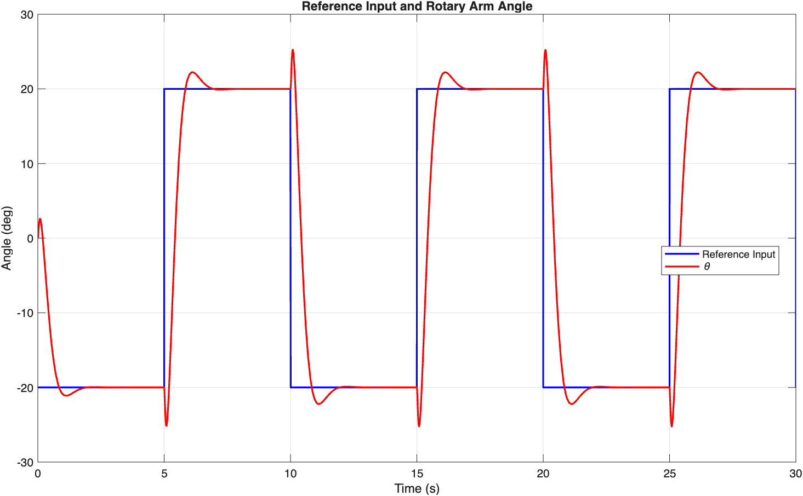
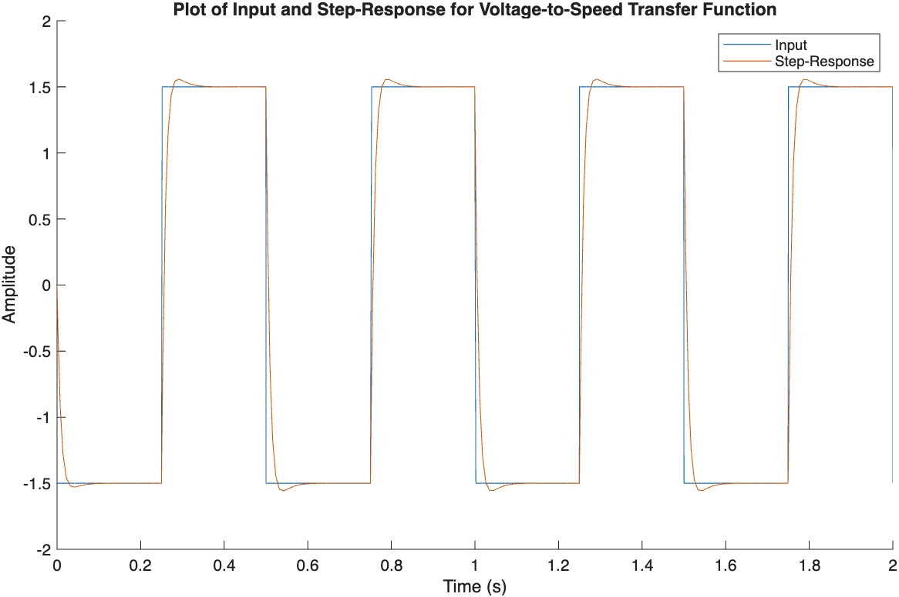
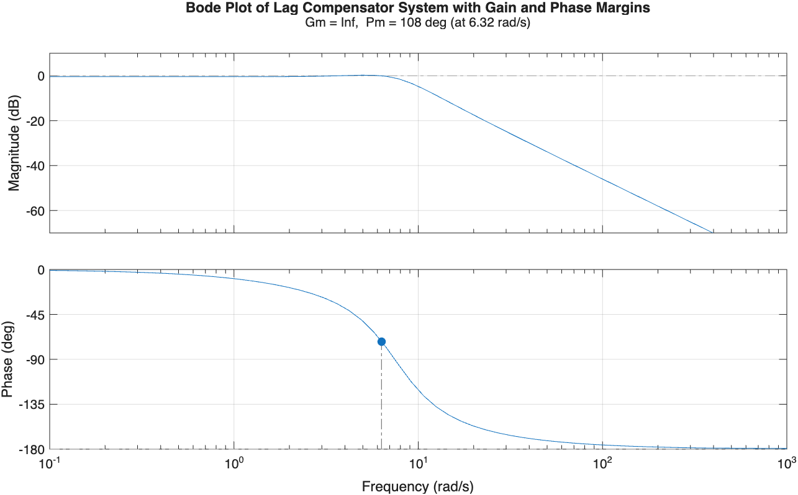
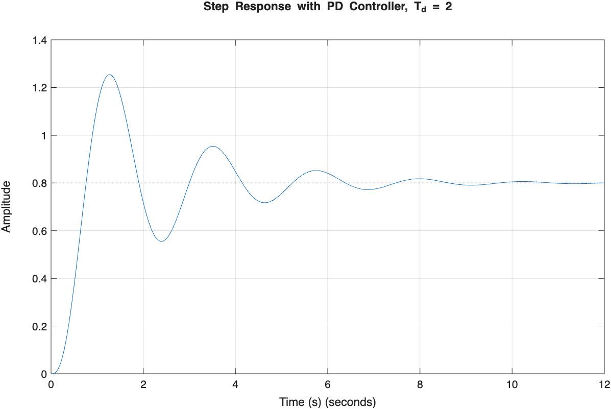
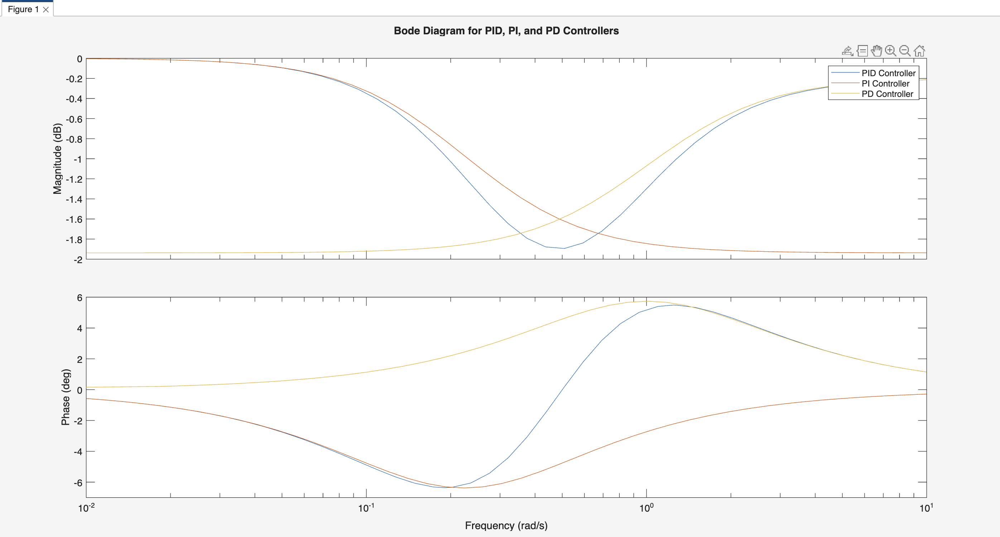
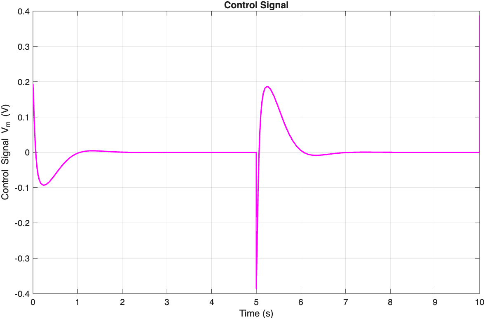

# Control Systems and Servo Motor Modeling

A three-lab MATLAB and Simulink portfolio covering dynamic-system modeling, open- and closed-loop response, stability, lead/lag compensation, classical P/PI/PD/PID control, DC motor models, and state-feedback control of a rotary servo/inverted-pendulum system.



## What is included

### Lab 1 — Dynamic systems and feedback fundamentals

- Sine, pulse, and step-response simulations
- First-, second-, and third-order transfer functions
- Open-loop versus unity-feedback response
- Steady-state error calculations
- Proportional-gain comparisons for `K = 2, 5, 10`
- Pole/zero inspection and Routh-Hurwitz critical-gain analysis
- Response of the third-order plant

```math
G(s)=\frac{1}{(s+1)^3}
```

### Lab 2 — Motor modeling and lead/lag compensation

- Physical and transfer-function model comparisons
- DC motor voltage-to-speed and voltage-to-position response
- First-order lead compensator analysis
- First-order and higher-order lag compensation
- Step, Bode, gain-margin, and phase-margin plots
- Saved simulation dataset for the motor study

The DC motor Simulink models include the transfer-function coefficients:

```math
G_m(s)=\frac{0.1284}{0.002136s+0.08403}
```

Representative compensators include:

```math
G_{lead}(s)=\frac{s+1}{0.1s+1}, \qquad
G_{lag}(s)=\frac{s+3}{s+0.3}
```



### Lab 3 — Controller design and servo state space

- PI-controller response for multiple integral times
- Filtered PD-controller response for multiple derivative times
- PID, PI, and PD frequency-response comparisons
- Ziegler–Nichols-style PID tuning exercises
- Rotary servo/inverted-pendulum state-space derivation
- Controllability analysis
- Pole placement with `place(A,B,poles)`
- Closed-loop rotary-arm reference tracking and control effort

The servo model uses four states, two measured outputs, and the standard form:

```math
\dot{x}=Ax+Bu, \qquad y=Cx+Du, \qquad u=-Kx
```

The parameters, matrices, controllability calculation, and selected poles are in `labs/lab-3/part-2/b/matlab-simulink/Lab3Part2B1.m`. The associated Simulink model uses a State-Space block and state-feedback gain `K`.

## Repository layout

```text
labs/
├── lab-1/
│   ├── part-1/              Signal and transfer-function models
│   ├── part-2/              Higher-order systems and feedback
│   └── parts-1-and-2-c/     Open/closed-loop and stability studies
├── lab-2/
│   ├── part-1/              Physical and DC motor models
│   ├── part-2/              Lead/lag compensator design
│   └── d/                   Higher-order lag and margin analysis
└── lab-3/
    ├── part-1/              PI, PD, PID, and tuning exercises
    └── part-2/              Rotary servo state-space control
```

Each section keeps its MATLAB scripts, Simulink models, saved data, and result figures together. Unpacked `.slx` internals, macOS metadata, and autosave archives were removed from the repository.

## Requirements

- MATLAB
- Simulink
- Control System Toolbox (`tf`, `feedback`, `stepinfo`, `bode`, `margin`, `ctrb`, and `place`)
- Signal Processing Toolbox for scripts that use `square`

## MATLAB and Simulink compatibility

The model metadata contains two save-version groups:

| Saved with | Model count | Notes |
| --- | ---: | --- |
| Simulink R2023a | 12 | Can be opened by R2023a or a compatible newer release |
| Simulink R2025b | 21 | Requires R2025b or newer; an older release cannot open these models directly |

The MATLAB scripts were checked with the R2025a Code Analyzer. All 33 scripts passed syntax analysis; the remaining findings are three informational missing-semicolon warnings where command-window output is useful. End-to-end runtime testing was not possible on this computer because its MATLAB installation does not include Control System Toolbox, and the R2025b models cannot be opened by the installed R2025a Simulink release.

## Running an experiment

1. Clone or download the repository.
2. Open MATLAB and set the repository as the current folder.
3. Navigate to the lab section you want to run.
4. Open the corresponding `.slx` model.
5. Run the simulation.
6. Run the adjacent `.m` analysis/plotting script.

For example, the Lab 3 rotary servo files are located in:

```text
labs/lab-3/part-2/b/matlab-simulink/
```

Run `Lab3Part2B1.m` first to create `A`, `B`, `C`, `D`, and `K` in the MATLAB workspace, then open and simulate `Lab3Part2B2.slx`.

Several plotting scripts expect named `Simulink.SimulationOutput` variables such as `out`, `outP1B1`, or `L2P2A1out`. If a script reports that one is missing, run its adjacent Simulink model first and confirm the model's output-variable name.

## Selected results

| Lag-compensator margins | PD-controlled step response |
| --- | --- |
|  |  |

| PID/PI/PD frequency comparison | Servo control effort |
| --- | --- |
|  |  |

## Model highlights

### Lead and lag compensation

Lab 2 compares compensated and uncompensated responses in both the time and frequency domains. The scripts use `stepplot`, `bode`, and `margin` to show how compensator poles and zeros affect transient response, bandwidth, and stability margins.

### Classical controller comparison

Lab 3 evaluates how proportional, integral, and derivative action change rise time, steady-state error, overshoot, settling behavior, and frequency response. The filtered derivative implementations avoid using an ideal differentiator directly.

### Rotary servo and inverted pendulum

The final model builds the coupled rotary-arm/pendulum state matrices from physical parameters, verifies controllability, places four closed-loop poles, and simulates state feedback. The result figures include rotary-arm angle tracking, pendulum response, and actuator control effort.

## Notes on the cleaned archive

- MATLAB citation artifacts that made one script invalid were removed.
- `Lab3_.P1C2m` was renamed to the valid MATLAB filename `Lab3_P1C2.m`.
- `Lab3_P1D3(2).m` was renamed to `Lab3_P1D3_response.m`.
- Original result figures and the Lab 2 `.mat` dataset were retained.
- No license is assigned; the repository remains all-rights-reserved unless the authors add one.

